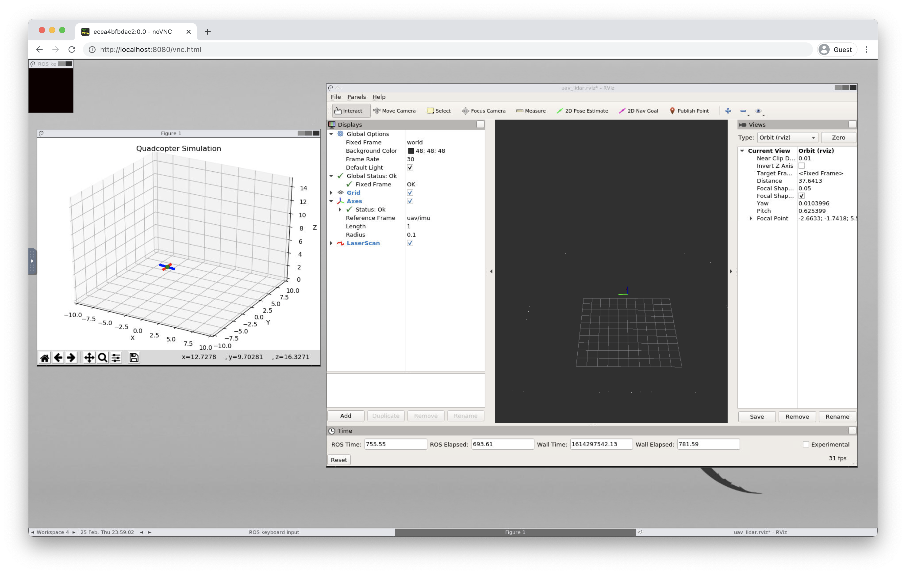

# CS4501 Robotics Docker Setup

This repository contains a docker setup for running [CS 4501 Robotics for Software Engineers](https://less-lab-uva.github.io/CS4501-Website/) labs. With this setup, users can access GUI applications such as `rviz` and `rqt` using their browser. It also uses a docker volume to store the lab code, so users can edit the lab code on their host machine using their IDE of choice.

## Prerequisites
You must have [Docker](https://www.docker.com/get-started) and [Docker Compose](https://docs.docker.com/compose/install/) installed.

## Quickstart
- `git clone git@github.com:brian-yu/cs4501-robotics-docker.git`
- `cd cs4501-robotics-docker`
- `git clone https://github.com/less-lab-uva/CS4501-Labs.git`
- `docker-compose up --build`
- Go to http://localhost:8080/vnc.html in your browser
- In a new terminal tab:
  - `docker-compose exec ros bash`
  - `cd CS4501-Labs/lab4_ws`
  - `catkin build`
  - `source devel/setup.bash`
  - `roslaunch flightcontroller fly.launch`
- In another terminal tab:
  - `docker-compose exec ros bash`
  - `cd CS4501-Labs/lab4_ws`
  - `source devel/setup.bash`
  - `rviz`
